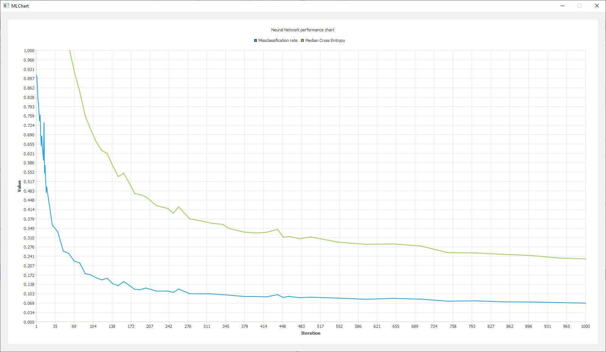
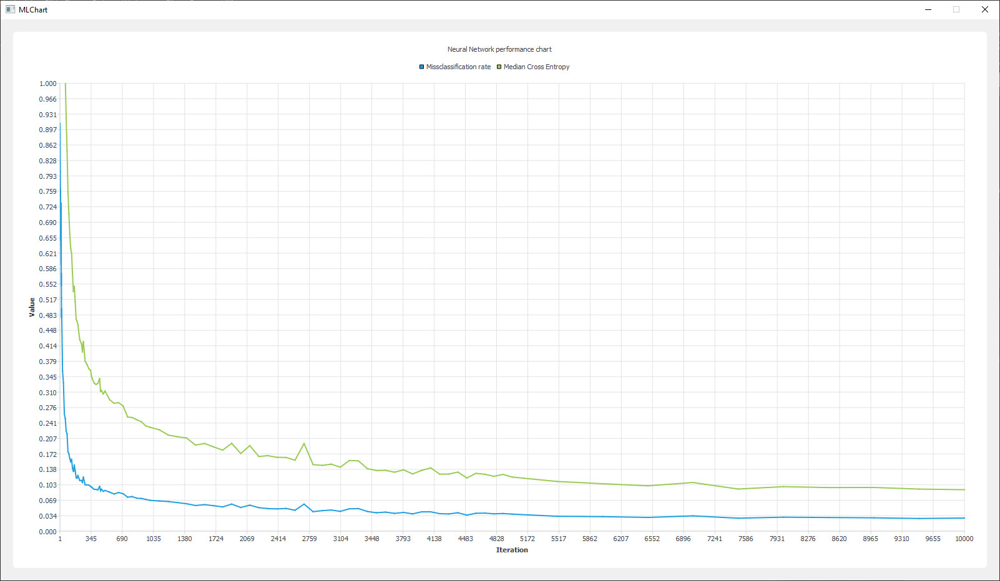
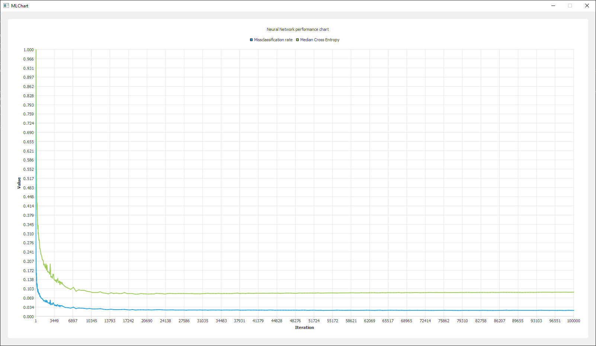

# ClassificationNN

This project features a neural network for classification, accelerated with Cuda by using only the Cuda runtime library as well as cuBLAS for matrix multiplication and cub for simple reductions. All neural network functions (like activation functions, foward propagation, backward propagation, minibatch gradient descent) were implemented from scratch. Finally Qt is being used to display the missclassification rate as well as the mean cross entropy (which is the cost function) of the test set.

As data set the [mnist dataset](https://en.wikipedia.org/wiki/MNIST_database) is used: A dataset with 28x28 images of handwritten digits.
The dataset contains up to 60.000 images in the training data and 10.000 images in the test set, but due to storage reasons only 50.000 images are included in the training set of this repository (github doesn't like files above 100 MB and the images are uncompressed).

The network can be configured to use multiple layers. Currently the best performing hyperparameters were a network with 2 hidden layers containing 500 nodes on the first and 20 nodes on the second hidden layer. The minibatch size was chosen as 100 (100 gradients are averaged and then one step in the direction of this gradient is being performed). There is most likely more optimization potential in the code and in the hyperparameters as well as some unexplained behaviour under some hyperparameter choices, for example under higher node counts per layer the training is getting more and more unstable which sometimes results in a diminishing misclassification rate.


# Network configuration:

Here are all properties and settings in a quick overview:

* layers: 
    * 784 (input - 28x28 images)
    * 500 (1st hidden)
    * 20 (2nd hidden)
    * 10 (output - 10 possible digits)
* minibatch:
    * batch size: 100
    * learning rate: 0.5 ( 0.005 in the code since gradients are summed and not averaged)
* activation functions:
    * input layer: none
    * 1st hidden layer: sigmoid
    * 2nd hidden layer: sigmoid
    * output layer: softmax
* cost function:
    * cross entropy

## Build the project
A cmake script is included in the project. Cuda 11 is recommended since cub is already included in Cuda 11. In previous versions cub must be downloaded separately and the CMake file needs to be changed to include this directory. Code is only tested under windows. To build the file with QT, QT needs to be installed and the ```QT5_DIR``` variable needs to be set appropriately.

## Results

The network was performing up to a missclassification rate of about 2.2% which is pretty reasonable. Similar implementations (see https://en.wikipedia.org/wiki/MNIST_database#Classifiers) were performing up to a missclassification rate of 1.6%. A small amount of the difference can be explained by the fact that only 50.000 / 60.000 images were used for training in this project, but even with the last 10.000 images the 2%-mark is almost never crossed. The given configuration of Wikipedia with a 784-800-10 network is actually performing worse with this implementation, but all in all the implementation is reasonably good and getting close to the best possible result.

On a GTX 1070 one forward propagation step takes about 0.1 ms while one minibatch step (100 forward and 100 backward propagations) takes around 10 ms.


Neural network performance after 1.000 minibatch iterations:



Neural network performance after 10.000 minibatch iterations:



Neural network performance after 100.000 minibatch iterations:


## License
Copyright © 2020 [andreasGBL](https://github.com/andreasGBL).

Licensed under the [GPLv3](./LICENSE.MD).
